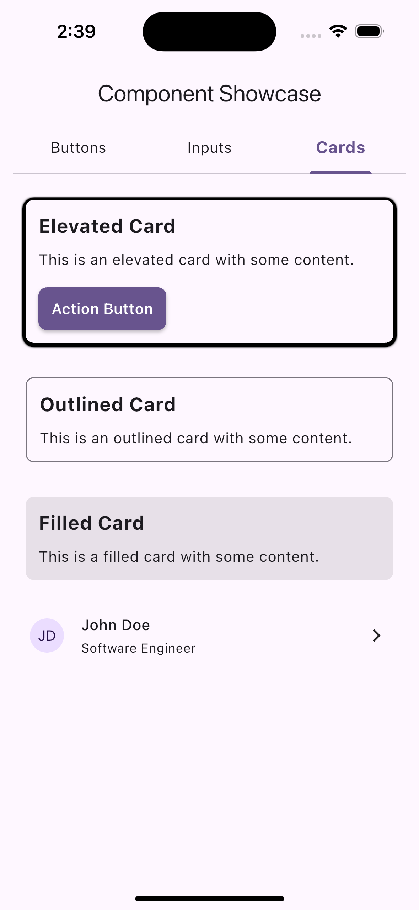

<!--
This README describes the package. If you publish this package to pub.dev,
this README's contents appear on the landing page for your package.

For information about how to write a good package README, see the guide for
[writing package pages](https://dart.dev/tools/pub/writing-package-pages).

For general information about developing packages, see the Dart guide for
[creating packages](https://dart.dev/guides/libraries/create-packages)
and the Flutter guide for
[developing packages and plugins](https://flutter.dev/to/develop-packages).
-->

# Modern Flutter UI Kit

[](https://flutter.dev/docs/development/packages-and-plugins/favorites)
[](https://pub.dev/packages/modern_flutter_ui_kit)
[](https://pub.dev/packages/very_good_analysis)

A comprehensive and modern Flutter UI kit that provides beautiful, customizable components and themes for building stunning applications. Built with Material Design 3 principles and optimized for both mobile and web platforms.

## ✨ Features

- 🎨 **Modern Theme System**
  - Material Design 3 compliant
  - Customizable color schemes
  - Typography system
  - Spacing and elevation tokens

- 🌓 **Theme Support**
  - Light and dark mode
  - Dynamic theme switching
  - Custom theme creation
  - Theme persistence

- 🎯 **UI Components**
  - Buttons (Primary, Secondary, Outlined, Text)
  - Text Fields with validation
  - Cards and containers
  - Navigation components
  - Form elements
  - Loading indicators
  - Dialogs and modals

- 📱 **Responsive Design**
  - Adaptive layouts
  - Mobile-first approach
  - Web optimization
  - Cross-platform compatibility

## 📸 Screenshots

<div align="center">
  
  
  
</div>

## 🚀 Getting Started

### Installation

Add the package to your `pubspec.yaml`:

```yaml
dependencies:
  modern_flutter_ui_kit: ^0.0.1
```

### Basic Usage

1. Import the package:

```dart
import 'package:modern_flutter_ui_kit/modern_flutter_ui_kit.dart';
```

2. Wrap your app with the theme provider:

```dart
void main() {
  runApp(
    ChangeNotifierProvider(
      create: (_) => ThemeProvider(),
      child: const MyApp(),
    ),
  );
}
```

3. Use components in your app:

```dart
// Button example
CustomButton(
  text: 'Click me',
  onPressed: () {
    // Handle button press
  },
  variant: ButtonVariant.primary,
);

// Text field example
CustomTextField(
  label: 'Email',
  hint: 'Enter your email',
  controller: emailController,
  keyboardType: TextInputType.emailAddress,
);
```

## 🎨 Theme Customization

Customize the theme to match your brand:

```dart
ThemeData(
  useMaterial3: true,
  colorScheme: ColorScheme.light(
    primary: Colors.blue,
    secondary: Colors.green,
    surface: Colors.white,
    background: Colors.grey[50],
    error: Colors.red,
  ),
  typography: Typography.material2021(),
  // ... other theme properties
);
```

## 📚 Documentation

For detailed documentation and API reference, visit our [documentation site](https://your-docs-site.com).

## 🤝 Contributing

We welcome contributions! Please read our [Contributing Guidelines](CONTRIBUTING.md) before submitting a Pull Request.

1. Fork the repository
2. Create your feature branch (`git checkout -b feature/amazing-feature`)
3. Commit your changes (`git commit -m 'Add some amazing feature'`)
4. Push to the branch (`git push origin feature/amazing-feature`)
5. Open a Pull Request

## 📝 License

This project is licensed under the MIT License - see the [LICENSE](LICENSE) file for details.

## 🙏 Acknowledgments

- Flutter team for the amazing framework
- Material Design team for the design system
- All contributors who have helped shape this project

## 📞 Support

For support, email me@therohitsoni.com
